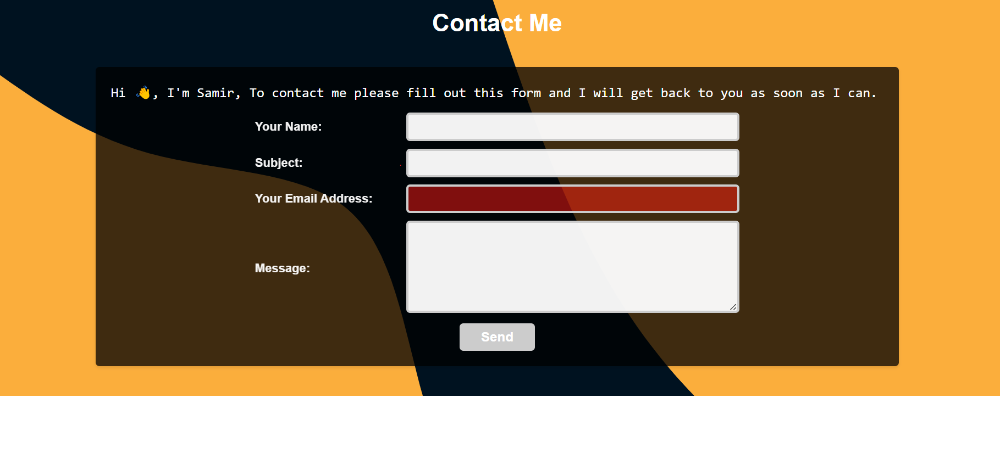
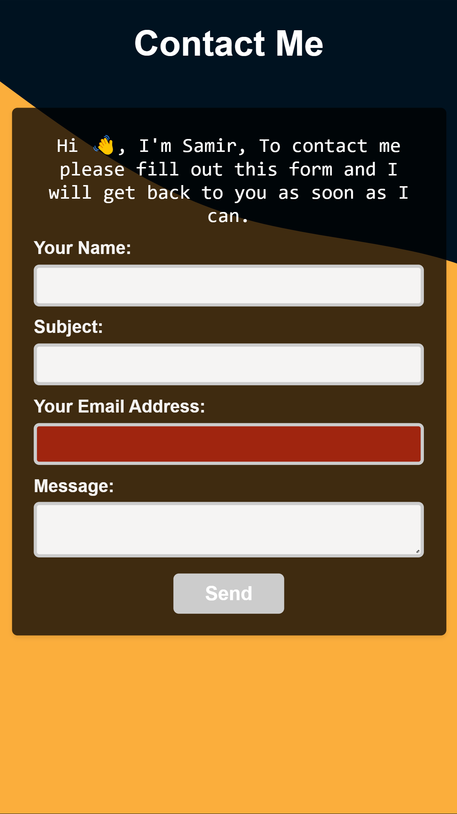

# Contact me

### A clean and simple webpage with a form to contact me. Uses gmail to send emails. Also a part of my (to-be) portfolio website.

<table>
  <td align="center"><b>Made using:</b></td>
  <td>
    
    
    
    
    
    
  </td>
</table>

###### Additional resources used: Namecheap (For the domain), Cloudflare (For https and certificate)

## **Click on the pictures/the link below to try!**

## [Click to open](https://samirkabra.me/contact)

## Features:

- A simple form to contact me.
- Does not allow more than 10 requests per hour (I'm not that popular yet) utilizes a server side cache to store the number of requests.
- Works on all devices. (Responsive)
